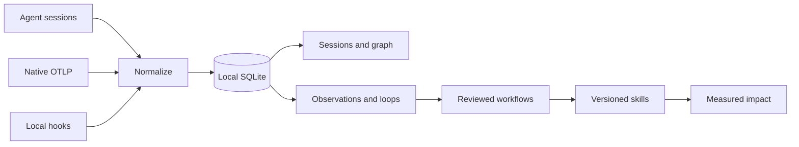
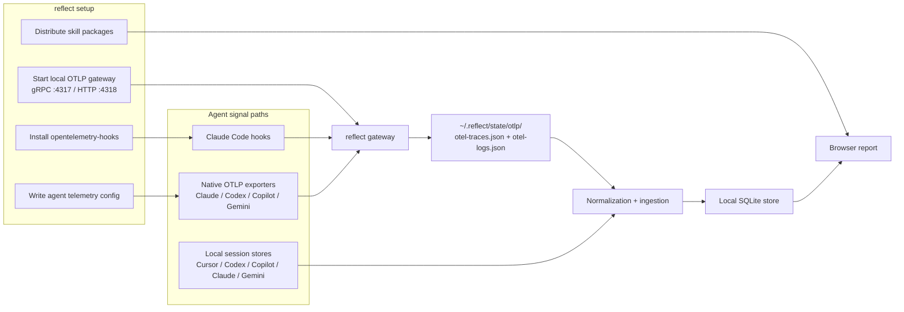

<p align="center">
  <a href="https://reflect.o11y.dev/">
    
  </a>
</p>

<h1 align="center">reflect</h1>

<p align="center">
  <strong>Evidence, Not Vibes.</strong><br>
  Local-first observability for failures, loops, context, cost, workflows, and skills across your AI coding-agent sessions.
</p>

<p align="center">
  <a href="https://pypi.org/project/o11y-reflect/"></a>
  <a href="https://pypi.org/project/o11y-reflect/"></a>
  <a href="https://github.com/o11y-dev/reflect/actions/workflows/test.yml"></a>
  <a href="LICENSE"></a>
</p>

<p align="center">
  <a href="https://reflect.o11y.dev/">Website</a> ·
  <a href="https://reflect.o11y.dev/report.html?report=reports/showcase.json">Live dashboard</a> ·
  <a href="https://pypi.org/project/o11y-reflect/">PyPI</a> ·
  <a href="CHANGELOG.md">Changelog</a>
</p>

Reflect turns local AI coding-agent sessions and OpenTelemetry signals into evidence you can act on. It shows where agents fail, stall, repeat work, lose context, or burn budget; preserves successful procedures as reviewable workflows and skills; and measures whether later sessions improve.

No hosted backend. No Reflect account. Your telemetry and SQLite ledger stay on your machine.

## Quick Start

Requires Python 3.11+ and [pipx](https://pipx.pypa.io/stable/installation/).

```bash
pipx install o11y-reflect
reflect setup
```

`reflect setup` detects supported agents, asks which ones to connect, starts the local OTLP gateway, configures verified telemetry paths, and installs Reflect's agent skills. Use your coding agents normally for a few sessions, then open the local report:

```bash
reflect doctor
reflect
```

`reflect doctor` checks capture health. `reflect` ingests new local evidence, starts or reuses the background report server, opens `http://127.0.0.1:8765`, and returns your terminal.

For a fast terminal usage snapshot without opening the browser:

```bash
reflect usage                 # current session usage
reflect usage --global --week # exact local usage across the last 7 days
```

`reflect setup` detects Bash, Zsh, or Fish and installs [Click's generated completion script](https://click.palletsprojects.com/en/stable/shell-completion/) idempotently by default. Use `--no-shell-completion` to opt out, or `reflect completion --install` to install it separately. Restart your shell once; command names, nested commands, flags, choices, paths, and local workflow, loop, skill, session, observation, and memory IDs will then complete with Tab. To inspect a script without changing shell files, run `reflect completion --shell zsh` (or `bash` / `fish`) without `--install`.

No telemetry yet? Open the bundled cross-agent dataset immediately:

```bash
reflect --demo
```

The demo includes Claude, Codex, Copilot, Cursor, and Gemini sessions.

### Private by default

Setup keeps hook prompt and response text out of telemetry unless you opt in. Interactive setup offers three local capture modes: metadata only, masked text, or full text. For automation, choose explicitly:

```bash
reflect setup --text-capture-mode metadata
```

Global, user-scoped setup is the default. Project-local hooks and skills require an explicit `--local-agent` selection:

```bash
reflect setup --agent "Claude Code" --local-agent "Claude Code"
```

Local traces, logs, session data, and the report database live under `~/.reflect/state/` and supported agent-owned local stores. Reflect does not send them to a hosted Reflect service.

## From Sessions to Improvement

The browser is organized around one evidence-to-value path:

| Surface | What it answers |
|---|---|
| **Inbox** | What recurring problems or loops need attention? |
| **Sessions** | What happened in one run, and how does it compare with another? |
| **Workflows** | Which reusable procedure is proposed, what evidence supports it, and what exact file will change? |
| **Skills** | Which searchable durable skill versions exist, where are they installed, and when were they used? |
| **Impact** | Did sessions improve after a workflow or skill was applied? |
| **Explore** | How do usage, tools, cost, context, and graph relationships change across filters? |

Reflect keeps observations, loops, workflows, and skills separate. A repeated loop can motivate a workflow, and an approved workflow can be packaged as a skill, but neither conversion happens automatically.

## What Reflect Measures

- Session quality, outcomes, conversation, execution, changes, and source evidence
- Token usage, cache behavior, estimated cost, model mix, and large-session concentration
- Tool and MCP reliability, latency percentiles, retries, recovery, and verification behavior
- Subagent delegation, completion, and effectiveness signals
- Cross-agent, workspace, repository, folder, path, session, skill, and outcome relationships
- Evidence-backed observations, reviewable workflow proposals, skill usage, and post-application measurements

## How It Works

Reflect combines the strongest verified local signal available for each agent:

- **Native OpenTelemetry** for supported agent OTLP traces and logs
- **Hooks** from [opentelemetry-hooks](https://github.com/o11y-dev/opentelemetry-hooks) for lifecycle and tool activity
- **Session adapters** for native local conversations and execution records when telemetry is incomplete

Each source is normalized into one cross-agent model and stored in local SQLite. The browser, CLI, session rules, improvement rules, graph, workflows, and Skills v2 registry all derive from that shared evidence rather than independent summaries.

Reflect understands the `opentelemetry-hooks` hook fact contract v1. Prompt, response,
stop-message, error, and delegation facts remain useful when content capture is disabled:
Reflect stores their length and SHA-256 evidence separately from any optional redacted
preview. Stable hook event IDs, provider adapters, schema versions, native trace links,
subagent and parent-agent IDs, and explicit workspace/repository identity are promoted into
queryable SQLite fields instead of requiring raw-JSON scans. The Session telemetry cockpit
shows the observed hook contract and native-link count, while Conversation and the graph use
the normalized message and delegation relationships. Legacy hook and native telemetry remain
supported through the existing fallback attributes.



## Commands

Reflect keeps four concepts separate:

- **Observations** are evidence-backed problems or opportunities found in sessions.
- **Loops** are repeated behavior: stalled retries with no relevant state change, or productive routines that repeatedly reach a good outcome.
- **Workflows** are reusable, reviewable procedures with ordered steps, stop conditions, recovery, and verification. They can come from a rule blueprint, an authoring agent, or an imported procedure.
- **Skills** are durable, versioned improvements with evidence, installations, usage, and measurement history.

A loop can motivate a workflow, and a workflow can be packaged as a skill, but neither conversion is automatic. A workflow may also become guidance, a checklist, an evaluation, or a future nudge as more renderers are added.

```bash
reflect                        # open local browser report (default)
reflect usage                  # show current-session tokens, cost, tools, models, and failures
reflect usage --session SESSION_ID # inspect one selected session
reflect usage --global --week  # aggregate every matching local session from the last 7 days
reflect usage --refresh         # ingest local sources first when freshness matters
reflect memory sync .          # sync local instruction memories for this folder
reflect memory list .          # list memories for this folder
reflect memory search "query" . # search local SQLite memory
reflect memory candidates .    # derive evidence-backed memory candidates from the graph
reflect memory providers       # inspect configured memory providers
reflect improve                # show highest-impact recurring problems and proposals
reflect improve OBSERVATION_ID # inspect one finding and its exact evidence
reflect ask "How should I debug CI here?" # retrieve workflows, evidence, and scoped memory
reflect loops                  # list stalled and productive repeated behavior
reflect loops show LOOP_ID     # inspect bounded source-session evidence
reflect loops build LOOP_ID --agent codex # author one pending workflow packaged as a skill
reflect workflows list         # list reusable procedures and review states
reflect workflows show WORKFLOW_ID # inspect steps, evidence, target, and exact diff
reflect workflows apply WORKFLOW_ID # approve and package the workflow as a repo-local skill
reflect workflows rollback WORKFLOW_ID # restore the prior repo-local file state
reflect skills                 # reconcile and list the durable Skills v2 registry
reflect skills show SKILL_ID   # inspect versions, evidence, installs, and usage
reflect skills discover --week # discover evidence-backed drafts with an agent
reflect skills apply SKILL_ID  # explicitly install a reviewed repo-local version
reflect skills rollback SKILL_ID # restore the prior repo-local file state
reflect workflows add SKILL.md # import a procedure from an existing skill file
reflect feedback SESSION_ID --outcome corrected --reason "why"
reflect --demo                 # instant demo with Claude/Codex/Copilot/Cursor/Gemini data
```

The browser uses the same SQLite ledger as the CLI and follows one evidence-to-value path. **Inbox** contains only findings and observed loops. **Sessions** contains session inspection and direct A/B comparison. **Workflows** contains reusable procedures with source evidence, exact review, delivery target, and rollback. **Skills** contains only durable packages, versions, installations, observed usage, and measurements, with instant multi-word search across identity, purpose, lifecycle, provenance, source agent, availability, and installation target. **Impact** is reserved for measured outcomes after a workflow is applied. **Explore** contains Usage, Tools, Graph, and Context views; generic cohort analysis lives under Explore → Usage, while Improvement Rule definitions and extension guidance live under Explore → Context, away from daily triage. A selected loop remains evidence until `reflect loops build LOOP_ID` asks an agent to author one pending workflow packaged as a skill; no loop is installed or converted automatically.

Browser links use the same product names: `tab=inbox|sessions|workflows|skills|impact|explore`, with `view=usage|tools|graph|context` when Explore is active. The matching read APIs are `/api/inbox`, `/api/impact`, and `/api/explore/{view}`; older tab names and endpoints remain read-only compatibility aliases for existing bookmarks and integrations.

Skill review links both the sessions that produced a draft and sessions that used it after activation. Selecting a repository chooses where `.agents/skills/<slug>/SKILL.md` will be created and does not change the evidence scope. Reflect records one active owner for that exact repository path so apply and rollback are hash-guarded and safe—this is ledger ownership, not a Git lock or filesystem lock. Session detail can record `good`, `bad`, `corrected`, or `no-change-correct` outcomes. Applying the same active version twice is idempotent. As comparable sessions arrive, Reflect records a new measurement only when the before/after cohort changes and surfaces regressions with a rollback path.

#### Session rules

Session rules are object-oriented quality dimensions that score one normalized session context. The default `SessionRuleRegistry` contains the eight 100-point dimensions shown in session detail: completion, efficiency, tool reliability, loop detection, duration health, error recovery, tool diversity, and edit productivity. Both detailed telemetry and SQLite dashboard summaries run through the same `SessionRuleScorer`; unavailable summary signals are marked as unavailable instead of being inferred.

Subclass `BaseSessionRule` to replace or add a dimension. A rule declares stable metadata and returns one bounded `SessionRuleResult` through the base `result()` helper:

```python
from reflect.session_rules import (
    BaseSessionRule,
    DEFAULT_SESSION_RULE_REGISTRY,
    SessionRuleDefinition,
    SessionRuleScorer,
)


class FocusedChangeSessionRule(BaseSessionRule):
    definition = SessionRuleDefinition(
        id="edit_productivity",
        version=2,
        name="Focused change",
        description="Rewards a session that turns exploration into a concrete edit.",
        max_points=5.0,
        signals=("AfterFileEdit", "BeforeReadFile"),
    )

    def score(self, context):
        changed = context.edits is not None and context.edits > 0
        return self.result(
            5.0 if changed else 0.0,
            "The session made a change." if changed else "No edit signal was present.",
            {"edit_present": changed},
        )


session_scorer = SessionRuleScorer(
    DEFAULT_SESSION_RULE_REGISTRY.extended(
        FocusedChangeSessionRule(),
        replace=True,
    )
)
```

Session rules calculate session quality only; they do not create observations or workflow candidates. Improvement rules analyze repeated/cohort evidence and turn actionable patterns—including aggregated session-rule results—into recommendations.

#### Custom improvement rules

Improvement rules are object-oriented, deterministic extensions over canonical Reflect SQLite data. Subclass `BaseImprovementRule`, declare a versioned `RuleDefinition`, and implement `detect()`. The base class provides `make_observation()` so rule identity, scope, fingerprinting, category, and severity remain consistent.

```python
from reflect.improvements import (
    BaseImprovementRule,
    DEFAULT_RULE_REGISTRY,
    ImprovementService,
    RuleDefinition,
)


class RepeatedFailedSessionRule(BaseImprovementRule):
    definition = RuleDefinition(
        id="repeated_failed_sessions",
        version=1,
        category="outcome",
        title="Repeated failed sessions",
        description="Finds repositories with several failed sessions.",
        detector_config={"minimum_sessions": 3},
        required_signals=["sessions.status"],
    )

    def detect(self, conn):
        rows = conn.execute(
            """
            SELECT repo_id, COUNT(*)
            FROM sessions
            WHERE status = 'error'
            GROUP BY repo_id
            HAVING COUNT(*) >= 3
            """
        ).fetchall()
        return [
            self.make_observation(
                identity=(repo_id or "local",),
                repo_id=repo_id,
                title="Sessions repeatedly end in error",
                summary=f"{count} sessions ended in error.",
                metric_name="failed_sessions",
                metric_value=count,
                metric_unit="sessions",
                metric_direction="lower_is_better",
                impact_score=min(100, 30 + count * 5),
                confidence=0.9,
                occurrence_count=count,
                affected_session_count=count,
            )
            for repo_id, count in rows
        ]


def improvement_service(conn):
    rules = DEFAULT_RULE_REGISTRY.extended(RepeatedFailedSessionRule())
    return ImprovementService(conn, rules=rules)
```

`RuleRegistry` rejects duplicate rule IDs unless replacement is explicit, and `ImprovementService` validates every emitted draft before persistence. Reflect does not automatically execute arbitrary Python files from a repository; integrations pass an explicit registry when constructing the service.

`reflect ask --json` returns at most one approved or active workflow plus freshness, constraints, verification, fallback, confidence, and evidence. Pending candidates can inform review but are labeled unapproved and are never applied automatically.

Live nudges remain intentionally unwired. Reflect packages a disabled metadata-only contract for a future local exchange under `~/.reflect/state/nudges/`; no current setup command creates that directory or configures `opentelemetry-hooks` to read it.

### Browser report server

Running `reflect` starts or reuses the local browser report server in the background and returns the terminal to you. Manage that server explicitly with:

```bash
reflect server start           # start the browser report in the background
reflect server status          # show its PID, URL, database, and log path
reflect server stop            # stop the background server
reflect --foreground           # run in the foreground for debugging
```

The default dashboard is served at `http://127.0.0.1:8765/?report=api/data`. The background server reads the SQLite store under `~/.reflect/state/`; `reflect doctor` reports whether it is running.

Session detail uses one normalized conversation contract across native Claude, Codex, Copilot, Cursor, and Gemini adapters, with telemetry-derived events as the fallback when a native transcript is unavailable. The SQL-backed dashboard follows each session's local source provenance and prefers the native transcript when it contains assistant responses, while keeping normalized telemetry for execution and diagnostics. Common agent aliases such as `claude-code`, `openai-codex`, `github-copilot`, and `gemini-cli` resolve through the same registry; integrations can add formats by implementing `SessionConversationAdapter` and registering it with `SessionConversationAdapterRegistry`.

The Conversation view defaults to a readable turn-focused transcript, keeps tool and MCP activity grouped beneath the relevant turn, and can switch to Full activity when every intermediate response is needed. Search matches prompts, responses, tools, models, servers, and subagents; result and failure navigation stay synchronized with the session timeline.

## Memory providers

Reflect keeps local SQLite as the source of truth and can mirror writes into optional memory backends. Provider failures do not block the local memory row; the local record is marked with provider status so you can inspect what was mirrored versus stored locally only. Reflect operational memories stay local by default; generic agent-session memory can route to `omega`, `agentmemory`, `litellm`, or `memorypalace` when explicitly configured.

```bash
reflect memory providers
reflect memory search "release gate" . --provider litellm
reflect memory search "release gate" . --provider omega
```

Configured providers:

| Provider | Reflect support | Role |
|---|---|---|
| `local_sqlite` | Built in | Default local source of truth under `~/.reflect/state/reflect.db` |
| `omega` | Integrated | Local [OMEGA Memory](https://github.com/omega-memory/omega-memory) semantic store through its public Python API |
| `agentmemory` | Connected | Generic Agent Memory HTTP endpoint via `AGENTMEMORY_URL` |
| `litellm` | Connected | LiteLLM Proxy `/v1/memory` key/value memory endpoint |
| `memorypalace` | Connected | Memory Palace-compatible HTTP memory endpoint |
| `mem0` | Discovery only | Installation and health visibility |
| `graphiti` | Discovery only | Installation and health visibility |
| `tencentdb_agent_memory` | Discovery only | Installation and health visibility |

OMEGA remains independently installed and configured; Reflect does not run `omega setup`, install its hooks, or read its private SQLite schema. Install the optional integration, initialize OMEGA deliberately, then inspect provider health:

```bash
pipx inject o11y-reflect "omega-memory>=1.5,<2"
omega setup
reflect memory providers
reflect memory search "release gate" . --provider omega
```

CLI searches with `--provider omega` and MCP `reflect_context` calls with `memory_provider="omega"` use OMEGA when its package and `~/.omega/omega.db` are available. Reflect does not expose generic memory CRUD through its MCP; use OMEGA's own MCP for that. Internal generic agent-session writes can mirror into OMEGA when `REFLECT_OMEGA_MEMORY_ENABLED=true`. Use `REFLECT_OMEGA_MEMORY_HOME` (or OMEGA's own `OMEGA_HOME`) when its store is not under `~/.omega/`.

LiteLLM memory is separate from LiteLLM pricing. To enable it, run a LiteLLM Proxy with a connected database and set:

```bash
export LITELLM_MEMORY_URL="https://litellm.internal"
export LITELLM_API_KEY="sk-..."
export LITELLM_MEMORY_KEY_PREFIX="reflect:" # optional
```

Optional LiteLLM memory scope overrides are `LITELLM_MEMORY_USER_ID` and `LITELLM_MEMORY_TEAM_ID`. If your key lives in another environment variable, set `REFLECT_LITELLM_MEMORY_API_KEY_ENV`.

To enable Memory Palace routing:

```bash
export MEMORYPALACE_URL="https://memorypalace.internal"
export MEMORYPALACE_API_KEY="sk-..." # optional
```

## Cost and pricing

Reflect estimates cost from observed token usage and model names. Pricing metadata comes from LiteLLM's model pricing map by default, with a local cache under `~/.reflect/cache/`.

### Use your own LiteLLM pricing source

By default, reflect uses LiteLLM's public model pricing map from `https://raw.githubusercontent.com/BerriAI/litellm/main/model_prices_and_context_window.json`. You can point reflect at your own LiteLLM deployment (or mirrored pricing endpoint) with `~/.reflect/config/litellm.json`:

```json
{
  "base_url": "https://litellm.internal",
  "model_prices_url": "https://litellm.internal/model_prices_and_context_window.json",
  "api_key_env": "LITELLM_INTERNAL_API_KEY",
  "timeout_seconds": 10,
  "pricing_unit": "coins"
}
```

If your live model names include suffixes or provider-specific variants that do not appear in the pricing map, add aliases in `~/.reflect/config/model-aliases.json`. Reflect uses those aliases to map your recorded model strings to the canonical LiteLLM keys that have pricing data, which is what lets cost show up in reports instead of staying at `0.00`.

You can also let reflect append safe aliases from the SQLite store:

```bash
reflect doctor cost
```

This scans observed SQL model names, preserves every existing alias, appends only new unambiguous mappings, and refreshes cost estimates. `reflect ingest` runs the same cost refresh after ingestion so reports have priced rows without a separate manual step.

```json
{
  "aliases": {
    "gpt-5.4-high": "gpt-5.4",
    "claude-4.6-opus-high": "claude-opus-4-5"
  }
}
```

Environment overrides are also supported for CI/ephemeral runs:

- `REFLECT_LITELLM_BASE_URL`
- `REFLECT_LITELLM_MODEL_PRICES_URL`
- `REFLECT_LITELLM_API_KEY_ENV`
- `REFLECT_LITELLM_TIMEOUT_SECONDS`
- `REFLECT_PRICING_UNIT`

## Local OTLP gateway

`reflect setup` automatically starts a lightweight OTLP gateway that listens for telemetry from all agents:

- **gRPC** on `127.0.0.1:4317` (Claude Code, Gemini CLI, Codex, otel-hook)
- **HTTP** on `127.0.0.1:4318` (GitHub Copilot)

The gateway writes received traces and logs as JSON lines to `~/.reflect/state/otlp/`, the same files `reflect` already reads. You can also manage the gateway manually:

```bash
reflect gateway start          # start as background daemon
reflect gateway stop           # stop the daemon
reflect gateway status         # check if running, show file sizes
reflect gateway --foreground   # run in foreground (for debugging)
```

## Health check

```bash
reflect doctor
reflect update
```

`reflect doctor` checks that your installation is healthy, shows which integrations are implemented vs still planned, and reports whether hooks are wired correctly, the OTLP gateway is running, LiteLLM pricing metadata is available for cost estimates, the installed package matches the latest release, and skill files are up to date. `reflect update --apply` upgrades the pipx package when a newer release is available.

### Native OTel details by agent

- **Claude Code** — `reflect setup` writes a `settings.json` `env` block with `CLAUDE_CODE_ENABLE_TELEMETRY=1`, OTLP endpoint/protocol keys, and `OTEL_LOGS_EXPORTER=otlp`. Claude's native path does not currently give `reflect` local traces, so hook spans or local session stores still provide tool-call/session coverage.
- **OpenAI Codex CLI** — `reflect setup` writes the current Codex `[otel]` contract in `~/.codex/config.toml`: `exporter` for logs, `trace_exporter` for interactive traces, and `log_user_prompt` aligned with the selected text-capture mode. It migrates obsolete Reflect-managed keys while preserving unrelated TOML sections and user-owned OTel settings. Reflect uses Codex's log records for session, model, tool, and token analytics, and filters low-level runtime trace spans.
- **GitHub Copilot VS Code** — `reflect setup` writes `github.copilot.chat.otel.enabled`, `github.copilot.chat.otel.otlpEndpoint`, `github.copilot.chat.otel.exporterType`, and `github.copilot.chat.otel.captureContent=false` in VS Code `settings.json`. The local gateway target is HTTP (`127.0.0.1:4318`) for Copilot.
- **GitHub Copilot CLI** — `reflect setup` also writes `COPILOT_OTEL_ENABLED=true` and `COPILOT_OTEL_OTLP_ENDPOINT=http://localhost:4318` into the same VS Code `env` block used by the CLI.
- **Gemini CLI** — `reflect setup` writes `telemetry.enabled`, `telemetry.target=local`, `telemetry.useCollector=true`, `telemetry.otlpEndpoint`, `telemetry.otlpProtocol`, and `telemetry.logPrompts=false`. If `~/.gemini/settings.json` does not exist yet, `reflect` leaves guidance only and `reflect doctor` will report the native path as missing.

### Why this differs from vendor OTLP guides

- `reflect` always points agents at a **local collector first**, not directly at a SaaS endpoint.
- The local setup path does **not** add auth headers or vendor-specific routing attributes.
- `reflect`'s bundled gateway currently persists **traces and logs only**. Even if an agent can emit OTLP metrics, metrics are not yet written into the local OTLP JSON cache.
- `reflect doctor` distinguishes between a native config that is absent, incomplete, unreadable, or ready so you can repair only the missing part.

## Agent instrumentation landscape

reflect's mission is to make every AI coding agent observable with zero manual instrumentation. Today, though, only a subset of integrations have verified telemetry collection. `reflect setup` detects agent homes for guidance, but it only starts collection where wiring and parsing are implemented.

| Agent | Instrumentation | What you get | Confidence |
|---|---|---|---|
| Claude Code | Native OTel + hooks | Native logs plus hook/session-based traces, tool calls, and sessions | High |
| OpenAI Codex CLI | Native OTel (interactive) | Log-derived sessions, models, tools, token usage, plus filtered traces | Medium |
| GitHub Copilot VS Code | Native OTel | Traces + logs to the local gateway with content capture disabled | High |
| GitHub Copilot CLI | Native OTel + hooks | Traces + logs via native OTel, plus hook coverage where available | High |
| Gemini CLI | Native OTel + hooks | Traces + logs via native OTel, with prompt logging disabled by default | High |
| Cursor | Session/log adapters | Tool calls, sessions, rough token estimates when exact usage is missing (`len(text) / 4`) | Medium |
| Windsurf | Hooks | Hook-derived sessions, prompts, tool calls, outcomes, and config snapshots; native OTel is not available | Medium |
| Trae, Cline, Roo Code, Goose, OpenHands, Amp, Continue, iFlow, Pi, OpenClaw | Not implemented yet | Detection, config snapshots, and skill distribution only | Planned |

**Why Cursor is only medium confidence:** local Cursor transcripts do not contain exact per-session usage, so reflect falls back to a rough `len(text) / 4` estimate when provider-side token usage is unavailable.

**Why Codex is medium confidence:** Codex native OTel is implemented and parsed, but the high-value records are currently emitted as logs rather than clean semantic spans. Reflect handles that shape, but the integration is still tied to Codex's interactive native OTel event names.

**Instrumentation paths:**
- **Native OTel** — agent has built-in OTLP export; reflect configures it to point at the local collector
- **Hooks** — `opentelemetry-hooks` intercepts agent lifecycle events (session start, tool calls, stop)
- **Session/log adapters** — reflect reads the agent's local session files directly when spans aren't available

When hook spans and OTLP traces are absent, `reflect` falls back to rich local session stores:

- Cursor: `~/.cursor/projects/**/agent-transcripts/**/*.jsonl`
- Codex CLI: `~/.codex/sessions/**/*.jsonl`
- Copilot: `~/.copilot/session-state/*/events.jsonl`
- Claude Code: `~/.claude/projects/**/*.jsonl`
- Gemini: `~/.gemini/tmp/**/chats/session-*.json`

## Advanced usage

### Direct OTLP traces

If you already have OTLP JSON traces from a collector, skip setup:

```bash
reflect --otlp-traces path/to/otel-traces.json
```

A sibling `otel-logs.json` file is used automatically when present. This matters for Codex because its useful native OTel data is log-based today. Put the files next to each other:

```text
otel-traces.json
otel-logs.json
```

### Legacy dashboard artifact

The browser report is now served from SQLite by default. The JSON artifact path is kept for compatibility with older GitHub Pages/static dashboard workflows:

```bash
reflect --dashboard-artifact docs/reports/latest.json
```

For a safe public example, this repo also ships a curated GitHub Pages demo:

- `https://reflect.o11y.dev/`

### All options

```
reflect [OPTIONS] [COMMAND]

Options:
  --sessions-dir PATH          Session metadata JSON directory
  --spans-dir PATH             Local span JSONL directory
  --otlp-traces PATH           OTLP JSON traces file
  --output PATH                Markdown report output path
  --dashboard-artifact PATH    Dashboard JSON artifact
  --db-path PATH               SQLite store used by browser report endpoints
  --demo                       Run with bundled sample data
  --help                       Show help

Commands:
  completion Generate or install autocomplete for every Reflect command
  setup    Install hooks, wire agents, configure telemetry, start gateway
  doctor   Check installation health and agent status
  update   Check release drift and optional package upgrade
  improve  Calculate or inspect durable, evidence-backed observations
  ask      Retrieve approved local guidance and linked evidence
  loops    Inspect agent-native continuations and observed behavioral loops
  workflows Review, package, apply, and roll back reusable workflows
  feedback Record a cheap session outcome label
  memory   Sync, search, validate, and route evidence-backed memories
  skills   Reconcile, discover, version, apply, and inspect durable skills
  gateway  Manage the local OTLP gateway (start/stop/status)
```

## Skills

`reflect skills` is the Skills v2 registry. It reconciles staged candidates, known skill directories, and telemetry-observed skill usage into stable skill identities. Each skill keeps immutable content versions plus source-agent, source-loop, source-session, installation-path, usage, and measurement links. The browser Skills tab loads the bounded registry and provides URL-persisted free-text search over names, descriptions, lifecycle, provenance, source agents, availability, and installation targets. If a tracked file disappears, its installation is marked missing rather than deleting its history.

The registry is intentionally broader than the skills available to the current agent. A Codex-visible skill must have an active package under a Codex or shared repository skill root; pending drafts, other-agent installations, and telemetry-only historical names remain reviewable registry records but are not presented as installed. The browser labels these states explicitly as **Available in Codex**, **Available in workspace**, **Pending review**, **Available to other agents**, **Telemetry only**, or **Not installed**.

Discovery is now explicit: `reflect skills discover` feeds the selected coding agent a deterministic evidence bundle built from session scores, recurring tool flows, shell commands, recovery chains, graph relationships, and bounded context from high-signal sessions. Valid output is stored as a pending skill version with its authoring agent and evidence. Older invocations such as `reflect skills --agent codex --week` still run in compatibility mode, but new scripts should use the `discover` subcommand.

`reflect loops` is independent from workflow and skill discovery. It combines behavioral evidence with strong agent-native continuation signals: Cursor `/loop` wake sentinels; Claude `/loop`, `/goal`, recurring `CronCreate`, and recurring `/schedule`; Copilot `/every` and its `/loop` alias; and Codex `/goal`. Gemini, Windsurf, and OpenCode reusable commands remain ordinary manual workflows unless telemetry shows repeated behavior. Reflect also records stalled loops from consecutive same-input runs with no intervening state change and productive routines with positive outcome evidence. Newly detected agent-native and stalled loops are listed before acknowledged or promoted history. `reflect loops build LOOP_ID` passes only the selected loop's bounded evidence to an agent and requires exactly one pending workflow packaged as a skill, with explicit state, iteration, exit, recovery, verification, and handoff contracts. The workflow and skill version remain linked to the loop and are never applied automatically.

Nothing is installed until an operator runs `reflect skills apply SKILL_ID` or `reflect workflows apply WORKFLOW_ID` from a Git repository, or approves the same target in the local browser. `reflect workflows show WORKFLOW_ID` reviews the procedure and exact delivery diff; `reflect skills show SKILL_ID` reviews the durable package history. `reflect workflows add path/to/SKILL.md` imports an existing skill file as a reviewable workflow. The current workflow renderer packages approved workflows under `.agents/skills/`; future renderers may target guidance, checklists, evaluations, or opt-in nudges without redefining the workflow itself.

## Data flow



`reflect setup` wires both hook-based and native OTLP paths into the local gateway. The gateway persists a shared OTLP traces/logs cache under `~/.reflect/state/otlp/`, while local session stores are ingested alongside that OTLP cache into the SQLite-backed browser report.

## Packaged Agent Skills

`reflect setup` distributes the packaged `reflect`, `reflect-usage`, and `reflect-skills` helpers to the global skill roots of the detected agents you select, including Codex, Claude Code, Cursor, Copilot, Gemini, and compatible shared-agent roots. It also installs the OpenTelemetry skill when that package is available. Run `reflect doctor` to detect missing or stale copies and rerun setup to refresh them.

In Codex, invoke `$reflect` for evidence-backed workflow guidance, `$reflect-usage` for current or aggregate usage statistics, and `$reflect-skills` for the durable skill registry. Codex discovers the user-wide copies from `~/.agents/skills/`; restart Codex if a newly installed skill does not appear. Other agents receive the same helpers in their native global skill roots and expose them through their own skill picker or invocation syntax.

Project-local copies are opt-in through `reflect setup --local-agent <agent>`. These bootstrap helpers are separate from the durable Skills v2 registry: the Reflect MCP selects relevant approved or active skill versions for an agent task, while generated or imported skills remain pending until an operator reviews and applies them explicitly.

## Reflect MCP

`reflect-mcp` is a standards-compliant local stdio server built with the stable official MCP Python SDK. It intentionally complements memory-provider MCPs instead of proxying them: OMEGA, Mem0, and similar products continue to own generic memory creation and recall, while Reflect exposes evidence-backed task context and provenance from its local telemetry ledger.

The server exposes a bounded agent task lifecycle plus three read-only inspection tools:

- `reflect_context` — start a non-destructive task guidance run with approved workflow guidance, selected versioned skills, observations, and path-scoped memory
- `reflect_complete` — close that task run after validation and record the agent-reported outcome for later measurement
- `reflect_improvements` — current evidence-backed findings without running detectors or applying changes
- `reflect_explain` — provenance for one observation, workflow, or local memory
- `reflect_usage` — exact local session or aggregate usage

Register the installed stdio command with the agents you use:

```bash
codex mcp add reflect -- reflect-mcp
claude mcp add --scope user reflect -- reflect-mcp
```

At the start of a non-trivial repository task, the `$reflect` skill calls `reflect_context` once after identifying the task and repository path and before implementation. The response includes a privacy-safe `task_run_id`, any selected skill version from an approved or active workflow, and an explicit `reflect_complete` follow-up. Selected skills expose one machine-readable `execution_state`: `follow_allowed` means the bounded instructions are complete, while `retrieve_full_instructions` requires the agent to call the supplied `reflect_explain` action before following the skill. Registry lifecycle and installation state remain separate, and installing or applying a skill still requires explicit operator approval. The agent calls `reflect_complete` after validation and before its final response. Neither tool applies workflows, installs skills, mutates agent configuration, or treats provider memory as verified Reflect evidence.

When MCP is unavailable, `$reflect` falls back to `reflect ask`, which uses the same read-only context service but cannot record the task lifecycle. The CLI remains an operator and automation surface rather than a requirement for ordinary agent work. See [`docs/mcp-agent-workflow.md`](docs/mcp-agent-workflow.md) for the phased MCP-first plan.

Reflect classifies MCP activity through one agent-neutral strategy registry rather than provider-specific branches. Standard OpenTelemetry MCP attributes, `mcp__server__tool` names, and payload-based calls are normalized for Codex, Claude Code, Cursor, Copilot, and Gemini; overlapping native, hook, and transcript records are reduced to the strongest available evidence. To smoke-test an installation, give an agent a repository mission that invokes `reflect_context` and `reflect_complete`, retain the returned session ID, and verify it with:

```bash
reflect usage --session <session-id> --refresh --json
```

The result should report `mcp_calls: 2` and list the session as successful. Both calls are visible in the session Conversation and MCP views in `reflect report`.

## Development

Source development uses Poetry:

```bash
poetry install --extras test
poetry run reflect --demo
poetry run reflect doctor
poetry run pytest tests/test_dashboard_json.py -q
poetry run pytest -q
```

## Analysis schema

See [`docs/ai-observability-schema.md`](docs/ai-observability-schema.md) for the canonical cross-tool analysis schema.

## License

[Apache-2.0](LICENSE)
