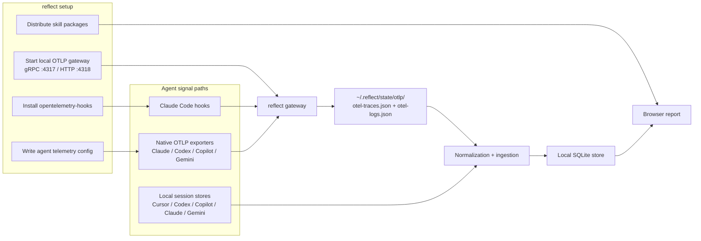

```
░▒▓███████▓▒░░▒▓████████▓▒░▒▓████████▓▒░▒▓█▓▒░      ░▒▓████████▓▒░▒▓██████▓▒░▒▓████████▓▒░
░▒▓█▓▒░░▒▓█▓▒░▒▓█▓▒░      ░▒▓█▓▒░      ░▒▓█▓▒░      ░▒▓█▓▒░     ░▒▓█▓▒░░▒▓█▓▒░ ░▒▓█▓▒░
░▒▓███████▓▒░░▒▓██████▓▒░ ░▒▓██████▓▒░ ░▒▓█▓▒░      ░▒▓██████▓▒░░▒▓█▓▒░        ░▒▓█▓▒░
░▒▓█▓▒░░▒▓█▓▒░▒▓█▓▒░      ░▒▓█▓▒░      ░▒▓█▓▒░      ░▒▓█▓▒░     ░▒▓█▓▒░░▒▓█▓▒░ ░▒▓█▓▒░
░▒▓█▓▒░░▒▓█▓▒░▒▓████████▓▒░▒▓█▓▒░      ░▒▓████████▓▒░▒▓████████▓▒░▒▓██████▓▒░  ░▒▓█▓▒░
```
# 

[](https://pypi.org/project/o11y-reflect/)
[](https://pypi.org/project/o11y-reflect/)
[](LICENSE)
[](https://github.com/o11y-dev/reflect/actions/workflows/test.yml)

**Behavioral memory for developer-agent behavior and workflow.**

Reflect turns agent telemetry into patterns about how developer-agent behavior and workflow actually work: prompt shape, tool loops, model mix, context breakage, token burn, and the mission shift happening across teams.

No hosted backend. No account. Runs on your machine.

```
$ reflect --demo

reflecting...
REFLECT
Inserted     0
Skipped      0
Normalized   0
Sessions     9

Serving browser report at http://127.0.0.1:8765
```

> Run this yourself: `pipx install o11y-reflect && reflect --demo`

## Quickstart

```bash
pipx install o11y-reflect
reflect setup
# use your AI tool normally for a bit, then:
reflect
```

`reflect setup` starts a local OTLP gateway and wires the supported agents you select. It edits global user-level agent config files, points native OpenTelemetry exporters at the local gateway, installs hook-based capture where that path is supported, and writes everything under `~/.reflect/state/`. In an interactive terminal, setup asks which detected agents to instrument. In scripts, use `--agent <name>` repeatedly or `--all-agents`.

Global/user-scoped setup is the default. Project-local hook and skill installs are available only by explicit opt-in, for agents or workflows that need repo-local instrumentation:

```bash
reflect setup --agent "Claude Code" --local-agent "Claude Code"
```

All `reflect setup` data is local and private to your machine: hook config, local spans, OTLP gateway files, and the SQLite report store live under local paths such as `~/.reflect/state/` and the opentelemetry-hooks state directory. `reflect` does not send this data to a hosted reflect service.

By default, hook spans keep prompt/response text out of telemetry and store metadata such as models, token counts, lengths, and hashes. In an interactive terminal, `reflect setup` offers a short local capture-mode prompt:

- **Metadata only** — no prompt/response text
- **Masked text** — capture local text with email/token/home-path masking
- **Full text** — capture local unmasked prompt/response text

For scripted setup, use `reflect setup --text-capture-mode metadata|masked|full`. The lower-level flags `--capture-text`, `--no-capture-text`, `--mask-captured-text`, `--no-mask-captured-text`, and `--text-max-chars` are also available.

Then use your AI tools normally and run `reflect`. The default command opens the local browser report backed by the SQLite store under `~/.reflect/state/`.

Legacy output modes remain available for now but are deprecated:

- `reflect report` — deprecated alias for `reflect`
- `reflect --terminal` — legacy Rich terminal view
- `reflect --no-terminal --output report.md` — legacy markdown report
- `reflect --dashboard-artifact out.json` — legacy static dashboard JSON artifact

## Demo

No telemetry yet? Try the bundled sample data:

```bash
reflect --demo
```

The demo includes Claude, Codex, Copilot, Cursor, and Gemini data. Codex is represented the same way it appears in real native OTel today: useful session/model/tool/token records are in a sibling `otel-logs.json` file, while low-level runtime trace spans are filtered out of the agent analytics.

## Requirements

- Python 3.11+
- [pipx](https://pipx.pypa.io/stable/installation/) (recommended) or pip

## What people actually find

Running `reflect` for the first time is usually surprising:

- One session consumed 30–40% of your total tokens (almost always a context blowout, not useful work)
- Your tool failure rate is higher than you thought — Bash failures often go unnoticed because the agent silently retries
- Cache hit rate varies dramatically by agent; switching prompt style can cut costs 30–50%
- If you use multiple agents, one is almost always measurably more efficient than the others for the same class of task

## How it works

`reflect` takes care of instrumentation and session data collection for the integrations that are implemented today. AI coding agents expose local signal in three ways, and `reflect setup` uses whichever verified path each agent supports:

- **Hooks** (Claude Code today) — scripts that fire at key lifecycle moments (session start, tool call, prompt, stop). `reflect setup` installs a small [opentelemetry-hooks](https://github.com/o11y-dev/opentelemetry-hooks) instrumentation layer into the agent's config file where that path is verified.
- **Native OpenTelemetry** (Claude Code, OpenAI Codex CLI, GitHub Copilot, Gemini CLI) — the agent has built-in OTLP export that just needs to be pointed at the local collector. `reflect setup` writes the relevant settings for each:
  - Claude Code: `env` block in `~/.claude/settings.json` (logs locally; traces still come from hooks/session stores)
  - OpenAI Codex CLI: `[otel]` section in `~/.codex/config.toml` with explicit trace/log exporters (interactive mode only)
  - GitHub Copilot VS Code: `github.copilot.chat.otel.*` keys in VS Code `settings.json`
  - GitHub Copilot CLI: `COPILOT_OTEL_ENABLED` / `COPILOT_OTEL_OTLP_ENDPOINT` env vars
  - Gemini CLI: `telemetry.*` keys in `~/.gemini/settings.json` (e.g. `telemetry.enabled`, `telemetry.otlpEndpoint`)
- **Session/log adapters** (Codex CLI, Cursor, Claude Code, Copilot, Gemini) — local transcript/session files fill gaps when native spans are absent or incomplete.

`reflect` records whichever verified local signal path is available. Hook-based flows emit OTLP spans for tool calls, token usage events, and session boundaries. Native OTel flows write traces and/or logs depending on the agent. Codex currently puts the useful agent-level records in OTLP logs (`codex.conversation_starts`, `codex.user_prompt`, `codex.tool_decision`, `codex.tool_result`, `codex.sse_event`), so `reflect` normalizes those records and ignores noisy low-level Rust runtime trace spans.

When you run `reflect`, it:

1. **Reads local telemetry** from `~/.reflect/state/otlp/`, local hook spans, or supported session stores
2. **Normalizes** them into a single cross-agent data model — so a Claude tool call and a Copilot tool call look the same
3. **Aggregates** per-session and cross-session metrics: token totals, tool failure rates, latency percentiles, subagent delegation patterns
4. **Serves** the browser report locally from SQLite, with deprecated terminal, markdown, and JSON artifact outputs still available for compatibility

Nothing leaves your machine. There's no cloud backend, no account, no API key.

## What you get

- **Token economy** — input, output, cache hits, largest-session concentration
- **Estimated cost analytics** — per-session/model/agent USD estimates, model cost concentration, pricing-source provenance
- **Tool efficiency** — failure rates, latency percentiles (p50/p90/p95/p99), tool-to-prompt ratio
- **Agent comparison** — side-by-side across Claude, Copilot, Gemini, Cursor
- **Model breakdown** — which models you're actually using and how much
- **MCP server tracking** — observed usage counts and completion gaps from recorded MCP events
- **Subagent patterns** — delegation frequency and types
- **Activity heatmaps** — by hour and day of week
- **Actionable recommendations** — based on your actual usage patterns

## Commands

```bash
reflect                        # open local browser report (default)
reflect report                 # deprecated alias for reflect
reflect --terminal             # deprecated terminal dashboard
reflect --no-terminal --output report.md  # deprecated markdown report
reflect --dashboard-artifact out.json  # deprecated JSON artifact
reflect skills                 # extract reusable skills from your sessions
reflect --demo                 # instant demo with Claude/Codex/Copilot/Cursor/Gemini data
```

## Cost and pricing

Reflect estimates cost from observed token usage and model names. Pricing metadata comes from LiteLLM's model pricing map by default, with a local cache under `~/.reflect/cache/`.

### Use your own LiteLLM pricing source

By default, reflect uses LiteLLM's public model pricing map from `https://raw.githubusercontent.com/BerriAI/litellm/main/model_prices_and_context_window.json`. You can point reflect at your own LiteLLM deployment (or mirrored pricing endpoint) with `~/.reflect/config/litellm.json`:

```json
{
  "base_url": "https://litellm.internal",
  "model_prices_url": "https://litellm.internal/model_prices_and_context_window.json",
  "api_key_env": "LITELLM_INTERNAL_API_KEY",
  "timeout_seconds": 10,
  "pricing_unit": "coins"
}
```

If your live model names include suffixes or provider-specific variants that do not appear in the pricing map, add aliases in `~/.reflect/config/model-aliases.json`. Reflect uses those aliases to map your recorded model strings to the canonical LiteLLM keys that have pricing data, which is what lets cost show up in reports instead of staying at `0.00`.

You can also let reflect append safe aliases from the SQLite store:

```bash
reflect doctor cost
```

This scans observed SQL model names, preserves every existing alias, appends only new unambiguous mappings, and refreshes cost estimates. `reflect ingest` runs the same cost refresh after ingestion so reports have priced rows without a separate manual step.

```json
{
  "aliases": {
    "gpt-5.4-high": "gpt-5.4",
    "claude-4.6-opus-high": "claude-opus-4-5"
  }
}
```

Environment overrides are also supported for CI/ephemeral runs:

- `REFLECT_LITELLM_BASE_URL`
- `REFLECT_LITELLM_MODEL_PRICES_URL`
- `REFLECT_LITELLM_API_KEY_ENV`
- `REFLECT_LITELLM_TIMEOUT_SECONDS`
- `REFLECT_PRICING_UNIT`

## Local OTLP gateway

`reflect setup` automatically starts a lightweight OTLP gateway that listens for telemetry from all agents:

- **gRPC** on `127.0.0.1:4317` (Claude Code, Gemini CLI, Codex, otel-hook)
- **HTTP** on `127.0.0.1:4318` (GitHub Copilot)

The gateway writes received traces and logs as JSON lines to `~/.reflect/state/otlp/`, the same files `reflect` already reads. You can also manage the gateway manually:

```bash
reflect gateway start          # start as background daemon
reflect gateway stop           # stop the daemon
reflect gateway status         # check if running, show file sizes
reflect gateway --foreground   # run in foreground (for debugging)
```

## Health check

```bash
reflect doctor
reflect update
```

`reflect doctor` checks that your installation is healthy, shows which integrations are implemented vs still planned, and reports whether hooks are wired correctly, the OTLP gateway is running, LiteLLM pricing metadata is available for cost estimates, the installed package matches the latest release, and skill files are up to date. `reflect update --apply` upgrades the pipx package when a newer release is available.

### Native OTel details by agent

- **Claude Code** — `reflect setup` writes a `settings.json` `env` block with `CLAUDE_CODE_ENABLE_TELEMETRY=1`, OTLP endpoint/protocol keys, and `OTEL_LOGS_EXPORTER=otlp`. Claude's native path does not currently give `reflect` local traces, so hook spans or local session stores still provide tool-call/session coverage.
- **OpenAI Codex CLI** — `reflect setup` writes a full `[otel]` section in `~/.codex/config.toml` with explicit `traces_exporter`, `traces_endpoint`, `logs_exporter`, `logs_endpoint`, and `log_user_prompt=false`, while preserving unrelated TOML sections. Reflect uses Codex's log records for session, model, tool, and token analytics, and filters low-level runtime trace spans.
- **GitHub Copilot VS Code** — `reflect setup` writes `github.copilot.chat.otel.enabled`, `github.copilot.chat.otel.otlpEndpoint`, `github.copilot.chat.otel.exporterType`, and `github.copilot.chat.otel.captureContent=false` in VS Code `settings.json`. The local gateway target is HTTP (`127.0.0.1:4318`) for Copilot.
- **GitHub Copilot CLI** — `reflect setup` also writes `COPILOT_OTEL_ENABLED=true` and `COPILOT_OTEL_OTLP_ENDPOINT=http://localhost:4318` into the same VS Code `env` block used by the CLI.
- **Gemini CLI** — `reflect setup` writes `telemetry.enabled`, `telemetry.target=local`, `telemetry.useCollector=true`, `telemetry.otlpEndpoint`, `telemetry.otlpProtocol`, and `telemetry.logPrompts=false`. If `~/.gemini/settings.json` does not exist yet, `reflect` leaves guidance only and `reflect doctor` will report the native path as missing.

### Why this differs from vendor OTLP guides

- `reflect` always points agents at a **local collector first**, not directly at a SaaS endpoint.
- The local setup path does **not** add auth headers or vendor-specific routing attributes.
- `reflect`'s bundled gateway currently persists **traces and logs only**. Even if an agent can emit OTLP metrics, metrics are not yet written into the local OTLP JSON cache.
- `reflect doctor` distinguishes between a native config that is absent, incomplete, unreadable, or ready so you can repair only the missing part.

## Agent instrumentation landscape

reflect's mission is to make every AI coding agent observable with zero manual instrumentation. Today, though, only a subset of integrations have verified telemetry collection. `reflect setup` detects agent homes for guidance, but it only starts collection where wiring and parsing are implemented.

| Agent | Instrumentation | What you get | Confidence |
|---|---|---|---|
| Claude Code | Native OTel + hooks | Native logs plus hook/session-based traces, tool calls, and sessions | High |
| OpenAI Codex CLI | Native OTel (interactive) | Log-derived sessions, models, tools, token usage, plus filtered traces | Medium |
| GitHub Copilot VS Code | Native OTel | Traces + logs to the local gateway with content capture disabled | High |
| GitHub Copilot CLI | Native OTel + hooks | Traces + logs via native OTel, plus hook coverage where available | High |
| Gemini CLI | Native OTel + hooks | Traces + logs via native OTel, with prompt logging disabled by default | High |
| Cursor | Session/log adapters | Tool calls, sessions, rough token estimates when exact usage is missing (`len(text) / 4`) | Medium |
| Windsurf, Trae, Cline, Roo Code, Goose, OpenHands, Amp, Continue, iFlow, Pi, OpenClaw | Not implemented yet | Detection, config snapshots, and skill distribution only | Planned |

**Why Cursor is only medium confidence:** local Cursor transcripts do not contain exact per-session usage, so reflect falls back to a rough `len(text) / 4` estimate when provider-side token usage is unavailable.

**Why Codex is medium confidence:** Codex native OTel is implemented and parsed, but the high-value records are currently emitted as logs rather than clean semantic spans. Reflect handles that shape, but the integration is still tied to Codex's interactive native OTel event names.

**Instrumentation paths:**
- **Native OTel** — agent has built-in OTLP export; reflect configures it to point at the local collector
- **Hooks** — `opentelemetry-hooks` intercepts agent lifecycle events (session start, tool calls, stop)
- **Session/log adapters** — reflect reads the agent's local session files directly when spans aren't available

When hook spans and OTLP traces are absent, `reflect` falls back to rich local session stores:

- Cursor: `~/.cursor/projects/**/agent-transcripts/**/*.jsonl`
- Codex CLI: `~/.codex/sessions/**/*.jsonl`
- Copilot: `~/.copilot/session-state/*/events.jsonl`
- Claude Code: `~/.claude/projects/**/*.jsonl`
- Gemini: `~/.gemini/tmp/**/chats/session-*.json`

## Advanced usage

### Direct OTLP traces

If you already have OTLP JSON traces from a collector, skip setup:

```bash
reflect --otlp-traces path/to/otel-traces.json
```

A sibling `otel-logs.json` file is used automatically when present. This matters for Codex because its useful native OTel data is log-based today. Put the files next to each other:

```text
otel-traces.json
otel-logs.json
```

### Legacy dashboard artifact

The browser report is now served from SQLite by default. The JSON artifact path is kept for compatibility with older GitHub Pages/static dashboard workflows:

```bash
reflect --dashboard-artifact docs/reports/latest.json
```

For a safe public example, this repo also ships a curated GitHub Pages demo:

- `https://reflect.o11y.dev/`

### All options

```
reflect [OPTIONS] [COMMAND]

Options:
  --sessions-dir PATH          Session metadata JSON directory
  --spans-dir PATH             Local span JSONL directory
  --otlp-traces PATH           OTLP JSON traces file
  --output PATH                Markdown report output path
  --terminal / --no-terminal   Deprecated terminal dashboard or markdown report
  --dashboard-artifact PATH    Deprecated dashboard JSON artifact
  --db-path PATH               SQLite store used by browser report endpoints
  --demo                       Run with bundled sample data
  --help                       Show help

Commands:
  setup    Install hooks, wire agents, configure telemetry, start gateway
  doctor   Check installation health and agent status
  update   Check release drift and optional package upgrade
  report   Open the AI usage dashboard in a browser
  skills   Extract reusable skills from your session history
  gateway  Manage the local OTLP gateway (start/stop/status)
```

## Skills

`reflect skills` feeds the extraction agent a deterministic evidence bundle built from session scores, recurring tool flows, shell commands, recovery chains, and bounded deep context from selected high-signal sessions. Proposed skills are tied to concrete improvement opportunities instead of loose pattern matching.

## Data flow



`reflect setup` wires both hook-based and native OTLP paths into the local gateway. The gateway persists a shared OTLP traces/logs cache under `~/.reflect/state/otlp/`, while local session stores are ingested alongside that OTLP cache into the SQLite-backed browser report.

## Skill package

`reflect` ships with a portable skill for Claude Code. After `reflect setup`, the `/reflect` skill is available in your Claude Code session for in-session telemetry analysis.

## Development

Source development uses Poetry:

```bash
poetry install --extras test
poetry run reflect --demo
poetry run reflect doctor
poetry run pytest tests/test_dashboard_json.py -q
poetry run pytest -q
```

## Analysis schema

See [`docs/ai-observability-schema.md`](docs/ai-observability-schema.md) for the canonical cross-tool analysis schema.

## License

[Apache-2.0](LICENSE)
