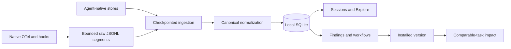

<p align="center">
  <a href="https://reflect.o11y.dev/">
    
  </a>
</p>

<h1 align="center">reflect</h1>

<p align="center">
  <strong>Evidence, Not Vibes.</strong><br>
  Evidence-backed improvement for AI agent work across teams.
</p>

<p align="center">
  <a href="https://pypi.org/project/o11y-reflect/"></a>
  <a href="https://pypi.org/project/o11y-reflect/"></a>
  <a href="https://github.com/o11y-dev/reflect/actions/workflows/test.yml"></a>
  <a href="LICENSE"></a>
</p>

<p align="center">
  <a href="https://reflect.o11y.dev/">Website</a> ·
  <a href="https://reflect.o11y.dev/report.html?report=reports/showcase.json">Live dashboard</a> ·
  <a href="https://pypi.org/project/o11y-reflect/">PyPI</a> ·
  <a href="CHANGELOG.md">Changelog</a>
</p>

Reflect is a local-first improvement loop for AI coding agents. It captures
what happened, discovers repeated engineering procedures, lets a developer
review a bounded workflow, and measures whether comparable future tasks
improved.

No hosted backend and no Reflect account are required. Telemetry, task
evidence, workflow reviews, and SQLite state remain on your machine.

## Quick Start

Reflect requires Python 3.12+ and
[pipx](https://pipx.pypa.io/stable/installation/).

```bash
pipx install o11y-reflect
reflect setup
reflect doctor
reflect
```

`reflect setup` detects local agents, lets you choose which integrations to
configure, starts the local OTLP gateway, registers `reflect-mcp`, and installs
the packaged Reflect skills. On macOS it can register the gateway and report
server for login startup; pass `--no-autostart` to opt out.

`reflect doctor` is the source of truth for capture readiness. It distinguishes
configuration from an observed event, an ingested session, and reconciled
logical calls.

### Ask through your agent

Use Reflect in the agent where the work is already happening:

```text
Use Reflect to explain why this session was expensive and what should improve.

Use Reflect to find a repeated engineering procedure worth making reusable.

Use Reflect to prepare an internal AI budget increase request from measured work.

Use Reflect to show whether an installed workflow improved comparable tasks.
```

The packaged skill starts a non-trivial repository task with
`reflect_context`, keeps selected guidance tied to a task run, and closes it
with `reflect_complete` after validation. It can inspect evidence and prepare a
review, but it cannot install or change a workflow without explicit human
approval.

### Explore visually in the UI

```bash
reflect
```

The browser opens at `http://127.0.0.1:8765`. It reads the same local SQLite
evidence as the CLI and MCP server.

No data yet? Open the bundled cross-agent demonstration:

```bash
reflect --demo
```

The demo contains Claude, Codex, Copilot, Cursor, and historical Gemini
sessions. Demo coverage is not a claim that every provider surface is currently
live-supported.

## From Personal Reflection to Organizational Improvement

The product loop is:

> task contract -> execution evidence -> human review -> installed workflow ->
> comparable future tasks -> measured impact

The browser has four surfaces:

| Surface | What it answers |
|---|---|
| **Sessions** | What happened, what did it cost, and which source evidence is available? |
| **Workflows** | Which findings, loops, procedures, and skill versions need review? |
| **Impact** | Did comparable task outcomes move after installation, and is attribution supported? |
| **Explore** | What do usage, tools, MCP, graph, context, and task contracts show? |

A finding or loop is evidence, not an installed improvement. Approval and
installation are separate. Impact begins only after a workflow is installed,
and missing baseline evidence is shown as unavailable rather than zero.

## What Reflect Can Prove

Reflect derives these views from canonical local evidence:

- session conversations, outcomes, duration, agents, and source provenance
- exact or explicitly estimated tokens and cost, with model and cache breakdowns
- one logical count per tool or MCP invocation
- failures, retries, recovery, verification, edits, and delegation
- bounded task executions and comparable task archetypes
- workflow contract adherence before and after installation
- measured outcome shifts and the evidence quality required for attribution

Reflect does not rank developers or agents. It does not combine unrelated task
types, treat an entire long-lived session as one task, or convert correlation
into causality.

## Trust and Privacy Contract

- Local traces, logs, native session data, and `reflect.db` stay under local
  state paths and supported agent-owned stores.
- Prompt and response text capture is opt-in. Setup offers metadata-only,
  masked-text, and full-text modes.
- Normalized evidence keeps source provenance and marks token/cost estimates.
- External or repository writes require exact preview and explicit approval;
  apply and rollback are separate recorded actions.
- Workflow impact exposes compared task IDs, cohort size, missing telemetry,
  evidence cutoff, and the reason a claim is withheld.
- Retention can remove telemetry without silently installing, applying, or
  changing reviewed workflows.

For non-interactive setup, choose capture explicitly:

```bash
reflect setup --text-capture-mode metadata
```

Project-local agent wiring is opt-in:

```bash
reflect setup --agent "Claude Code" --local-agent "Claude Code"
```

## Agent Capability Truth

Support is declared per surface. A working MCP connection does not prove native
tokens, cost, hooks, or transcripts.

| Agent | Status | Current evidence path |
|---|---|---|
| Claude Code | Supported | Native OTel, hooks, and native sessions |
| OpenAI Codex CLI | Supported | Native OTel and native sessions |
| GitHub Copilot | Supported | Native OTel, hooks, and native sessions |
| Cursor | Supported | Native session/log adapters and optional hooks; exact tokens may be unavailable |
| OpenCode | Supported | Native SQLite sessions and hooks |
| Windsurf | Supported | Hooks and configuration snapshots; MCP is editor-config only |
| Antigravity (`agy`) | Partial | Reflect MCP task runs; native tool telemetry and hooks are not verified |
| Gemini CLI | Historical | Existing native OTel and session data remain readable; it is not a current live-test target |

Planned agents may be inventoried for configuration or skill paths, but Reflect
does not label them as capturing.

The registry in `src/reflect/agent_capabilities.py` feeds setup, doctor, aliases,
skill distribution, MCP configuration, and local-agent tests.

## How Capture Works


```mermaid
flowchart LR
    A[Native OTel and hooks] --> B[Bounded raw JSONL segments]
    C[Agent-native stores] --> D[Checkpointed ingestion]
    B --> D
    D --> E[Canonical normalization]
    E --> F[(Local SQLite)]
    F --> G[Sessions and Explore]
    F --> H[Findings and workflows]
    H --> I[Installed version]
    I --> J[Comparable-task impact]
```

The gateway appends to `otel-traces.active.jsonl` and
`otel-logs.active.jsonl`, rotating immutable closed segments at a bounded size.
Refresh checkpoints each source, normalizes new records, and deletes only
closed segments whose events normalized successfully. Use
`--keep-processed-raw` when replay files must be retained.

`tool_calls` stores one logical invocation. `mcp_calls` is a one-to-one metadata
extension for MCP server, tool, transport, and protocol identity, not a second
call ledger.

See [the current architecture](docs/current-architecture.md) for module and data
ownership.

## Common Commands

```bash
reflect usage                         # current runtime usage
reflect usage --global --period week # all matching local usage for seven days
reflect refresh --json               # explicit ingest and snapshot refresh
reflect improve                      # scoped findings
reflect loops                        # observed stalled or productive loops
reflect workflows list               # reviewable and historical workflow state
reflect skills                       # durable skill registry
reflect memory sync .                # sync scoped instruction memory
reflect doctor                       # capture and installation diagnostics
```

Read commands inspect an existing query-only snapshot. Commands that refresh,
install, roll back, prune, or vacuum are explicit mutations.

### Direct OTLP input

An explicit trace file remains supported for imports and tests:

```bash
reflect --otlp-traces path/to/otel-traces.json
```

If a sibling `otel-logs.json` exists, Reflect reads it as the corresponding log
source. The managed gateway uses the bounded `.active.jsonl` segment names.

## Workflow and Impact Lifecycle

Reflect keeps these states separate:

1. Evidence produces a finding or loop.
2. A workflow candidate defines a typed procedure and validation window.
3. The developer's human review approves an exact immutable revision.
4. Explicit apply installs that version at one target.
5. The next comparable task executions record exposure and adherence.
6. Impact compares the frozen baseline with the bounded post-install cohort.
7. The developer keeps, revises, or rolls back the installation.

An approved-but-uninstalled workflow is never selected as executable guidance.
Workflow identity comes from contract semantics; a title or wording edit alone
does not invent a new procedure.

## Reflect MCP

`reflect-mcp` is a local stdio MCP server. Its main tools are:

- `reflect_context` — start task-specific guidance
- `reflect_record_milestone` — record idempotent workflow checkpoints
- `reflect_complete` — close the task after validation
- `reflect_improvements`, `reflect_patterns`, `reflect_skills`, and
  `reflect_impact` — bounded read-only evidence
- `reflect_explain` and `reflect_usage` — provenance and exact usage
- `reflect_review_change` — return an exact diff, target, risks, and rollback
- `reflect_apply_change` — consume only the explicitly approved exact review

Setup writes the appropriate client configuration for Claude, Cursor,
Antigravity, Copilot, Codex, OpenCode, and Windsurf. Windsurf has no supported
headless test surface. Historical Gemini telemetry parsing is independent of
current Antigravity MCP configuration.

To verify one task lifecycle after capture:

```bash
reflect usage --session <session-id> --refresh --json
```

A task that called `reflect_context` and `reflect_complete` should show two
successful logical MCP calls once its runtime telemetry has been ingested.

## Shell Completion

Setup installs Click completion for Bash, Zsh, or Fish by default. Restart the
shell once, or manage it directly:

```bash
reflect completion --install
reflect completion --shell zsh
```

## Development

Source development uses Poetry:

```bash
poetry install --extras test
poetry run reflect --demo
poetry run reflect doctor
poetry run pytest tests/test_dashboard_json.py -q
poetry run pytest -q
```

The browser is authored in `src/reflect/frontend/`. Regenerate both shipped
single-file artifacts after client changes:

```bash
poetry run python scripts/build_dashboard.py
```

Before a release:

```bash
poetry run ruff check .
poetry run pytest -q --no-cov
poetry run python scripts/release_workflow.py release-notes 0.9.6
```

See [AGENTS.md](AGENTS.md) for repository conventions,
[PRODUCT.md](PRODUCT.md) for bounded product priorities, and
[the analysis schema](docs/ai-observability-schema.md) for canonical telemetry
fields.

## License

[Apache-2.0](LICENSE)
