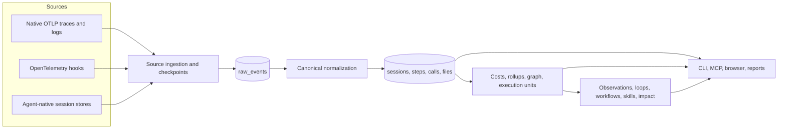
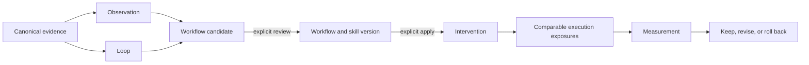

# Reflect current architecture

Status: current implementation.
Last reviewed: 2026-08-05.

This document is a map, not an aspiration. It records what owns each concept today,
which decisions are intentional, and where old and new models overlap. When this
document disagrees with the code or SQLite migrations, the implementation wins and
this document should be corrected.

Quick navigation:

- [System at a glance](#system-at-a-glance)
- [Domain model](#domain-model)
- [Architecture decision register](#architecture-decision-register)
- [Transitional boundaries and known contradictions](#transitional-boundaries-and-known-contradictions)
- [Complexity hotspots](#complexity-hotspots)
- [Open architecture decisions](#open-architecture-decisions)

## How to use this document

- **Canonical** means new behavior should use this source of truth.
- **Compatibility** means the path is retained for old data or public behavior but
  should not gain new product responsibility.
- **Transitional** means two representations still exist and need an explicit
  convergence decision.
- **Open** means the current behavior is known but the durable boundary is not yet
  enforced.

Before adding a table, status, identifier, adapter, or service, find the relevant
decision and domain object below. Extend the current owner unless a boundary change
is deliberate and documented.

## System at a glance

Reflect is a local-first telemetry and improvement system. It captures or reads agent
activity, normalizes it into a canonical SQLite model, derives analysis state, and
serves several views over the same evidence.



The intended dependency direction is:

```text
source adapters -> ingestion -> normalization -> canonical store
    -> derived state -> application services -> presentation surfaces
```

Presentation code must not become a second analytics source of truth. In particular,
dashboard cards and top-N summaries are output models, not aggregation inputs.

## Runtime surfaces

| Surface | Current owner | Responsibility |
|---|---|---|
| CLI | `src/reflect/core.py` | Operator commands, setup, maintenance, and orchestration |
| MCP | `src/reflect/mcp.py`, `context.py`, `changes.py` | Agent guidance, task completion, inspection, and approval-gated changes |
| Browser API | `src/reflect/dashboard.py` | SQLite-only report payloads, drill-down APIs, and review endpoints |
| Browser client | `src/reflect/data/index.html` | Single-file local dashboard |
| Hosted/local report copy | `docs/report.html` | Byte-for-byte copy of the packaged dashboard client |
| Report daemon | `src/reflect/report_server.py` | PID, port, and detached server lifecycle |
| OTLP gateway | `src/reflect/gateway.py` | Local OTLP receive and file-export lifecycle |
| Terminal/Markdown | `terminal.py`, `report.py` | Render canonical `TelemetryStats` views |

The MCP interface is the primary runtime interface for coding agents. The CLI and
browser remain operator, audit, debugging, and automation surfaces. None of these
surfaces owns a separate workflow or skill registry.

## Canonical data flow

### 1. Discover and ingest

`parsing.py` discovers OTLP files and supported agent-native stores. Provider-specific
details are normalized at the source boundary rather than spread through shared
analysis code. `store/ingest.py` records source fingerprints and append checkpoints,
then inserts durable raw events.

Raw input files are capture inputs and replay sources. SQLite is the analytical store.
Deleting a processed raw file must not redefine the canonical domain model, although
it can remove the ability to replay that source.

### 2. Normalize canonical evidence

`store/normalize.py` and its focused helpers promote raw events into canonical records:

- sessions and parent/child relationships
- steps and conversation facts
- LLM calls and tool calls
- files, repositories, workspaces, agents, and provenance
- task-run reconciliation when late telemetry becomes available

`tool_calls.logical_call_id` is the canonical invocation identity. Provider invocation
and result events sharing that identity are merged during normalization; migration 25
also reconciles retained duplicates. `mcp_calls` enriches an invocation with MCP
protocol identity and is not an additional tool-call count.

Canonical records retain native attributes for explanation while promoting shared
fields for queries and comparisons. The mapping contract is documented separately in
[`ai-observability-schema.md`](ai-observability-schema.md).

### 3. Refresh derived state

`core._prepare_sql_report_db()` currently orchestrates the complete preparation path:

1. migrate the schema
2. ingest changed sources
3. normalize pending events
4. reconcile fingerprints, MCP calls, workspace identity, and native estimates
5. refresh costs
6. refresh the evidence graph and usage rollups
7. refresh execution units, archetypes, improvements, workflows, skills, and impact

`preparation.py` owns the reusable snapshot policy, progress stages, and background
worker. Read commands inspect an existing snapshot through query-only connections.
Mutation requires an explicit refresh path.

### 4. Render and inspect

There are two established rendering paths:

- `TelemetryStats` fans out to terminal and Markdown reports.
- SQLite-only browser APIs query the canonical and derived tables directly for
  bounded interactive payloads.

Both paths represent the same domain. New browser-only calculations must not silently
create a competing metric definition.

## Domain model

### Telemetry and execution

| Object | Meaning | Current source of truth |
|---|---|---|
| Session | Provider conversation or long-lived agent container | `sessions` |
| Step | Ordered activity within a session | `steps` |
| LLM call | One normalized model request/response | `llm_calls` |
| Tool call | One logical normalized tool invocation | `tool_calls.logical_call_id` |
| Execution unit | One bounded piece of work used for comparable evidence | `execution_units` |
| Task run | One explicit MCP guidance/completion lifecycle | `mcp_task_runs` |
| Task archetype | Classification used to form comparable cohorts | `execution_unit_archetypes` for new cohort logic |

A session remains the aggregate unit for activity, duration, tokens, cost, and
navigation. It is not necessarily one task. Execution units are used only where a
bounded procedure must be compared for workflow adherence or impact. An explicit MCP
task run is the strongest execution boundary; whole-session boundaries are a
conservative workflow-evidence fallback.

### Improvement loop

| Object | Meaning | Current source of truth |
|---|---|---|
| Observation | Versioned rule finding for one scope and fingerprint | `observations` |
| Observation evidence | Bounded supporting or contradicting provenance | `observation_evidence` |
| Finding | Presentation-time grouping of equivalent observations | `ImprovementService`; not a separate table |
| Loop | Repeated stalled or productive behavior | `loop_patterns`, `loop_occurrences` |
| Workflow contract | Typed reusable procedure, applicability, milestones, and validation | `WorkflowContract` embedded in workflow content |
| Workflow candidate | Reviewable proposal produced from evidence | `workflow_candidates` |
| Workflow version | Approved immutable candidate content | `workflow_versions` |
| Intervention | Applied workflow version at a target | `interventions` |
| Exposure | Evaluation of an intervention against an execution unit | `workflow_exposures` |
| Measurement | Before/after intervention result | `measurements` |

### Durable skills

| Object | Meaning | Current source of truth |
|---|---|---|
| Skill | Searchable durable procedure identity | `skills` |
| Skill version | Immutable rendered instruction content | `skill_versions` |
| Installation | A version installed at a concrete target path | `skill_installations` |
| Usage | Selection or observed use in one execution unit | `skill_usage` |
| Skill measurement | Skill-oriented projection of measured impact | `skill_measurements` |

Exposure and usage are intentionally distinct. Exposure asks whether an installed
workflow was available, invoked, and followed. Usage asks whether the skill was
selected, reported, or observed. They may refer to the same execution unit without
being duplicate records.

## Improvement lifecycle



Promotion and application are never automatic. Review, approval, apply, and rollback
are separate actions. MCP change reviews bind approval to the exact target, content,
and prior state.

## Architecture decision register

| ID | Status | Decision | Consequence |
|---|---|---|---|
| A-001 | Accepted | SQLite is the local analytical source of truth. | CLI, MCP, and browser reads should share canonical persisted evidence. |
| A-002 | Accepted | Preserve raw/native provenance while promoting canonical fields. | Cross-agent comparisons remain possible without losing forensic detail. |
| A-003 | Accepted | Snapshot reads are query-only; refresh is explicit. | Inspection cannot silently ingest, migrate, reconcile, or rebuild. |
| A-004 | Accepted | Execution units, not whole sessions, are the comparison unit for procedures. | Long-lived sessions can contribute several comparable tasks without merging them. |
| A-005 | Accepted | Workflow contracts define reusable procedures and symmetric adherence. | The same milestones and validation rules apply before and after installation. |
| A-006 | Accepted | Workflows are review artifacts; Skills v2 is the durable package registry. | MCP, CLI, and browser must reuse one preview/apply/version path. |
| A-007 | Accepted | External or repository writes require exact preview and explicit approval. | Stored reviews are immutable, expiring, and bound to rollback information. |
| A-008 | Accepted | Stateful and swappable behavior uses small services/classes; transformations stay pure. | New abstractions need a real lifecycle, strategy, or ownership boundary. |
| A-009 | Accepted | Retention removes old session data while preserving bounded historical provenance and tombstones. | Current support and historical audit must be distinguishable. |
| A-010 | Accepted | Dashboard source and `docs/report.html` remain byte-identical. | Every dashboard client change must update both files together. |
| A-011 | Accepted | Browser reads are SQLite-only and query-only. | Dashboard refresh owns writes; ordinary API requests do not migrate or alter journal state. |
| A-012 | Accepted | `tool_calls` represents logical invocations, not telemetry phases. | Invocation/result duplicates are reconciled before rollups and procedure detection. |
| A-013 | Accepted | Context & System is project/store context, not session-owned telemetry. | Selecting a session must not hide specs, durable memory, privacy findings, or store inventory. |
| A-014 | Accepted | Full tool and graph views are calculated on demand. | Startup caches the lightweight usage summary and binds before command parsing or graph drill-down work. |

## Transitional boundaries and known contradictions

These are current architecture facts, not recommendations to add more layers.

| Area | Current overlap | Durable direction |
|---|---|---|
| Workflow identity | `WorkflowContract.signature_hash` identifies a procedure, while `workflow_proposal_signature()` hashes mutable title/content and is also used for grouping. | Contract identity owns the procedure; proposal hash owns only a revision. |
| Evidence unit | Procedure discovery and some ledgers still count sessions; adherence and impact use execution units. | Use retained eligible execution units for procedure support and measurement; keep session IDs as provenance. |
| Archetypes | `session_task_archetypes` and `execution_unit_archetypes` are both written and queried. | Execution-unit archetypes are canonical for new behavior; session classification is compatibility until remaining readers migrate. |
| Lifecycle | Observation, candidate, version, intervention, skill, and installation each persist statuses such as `active`. | Each status describes only its own object; product state should be a derived projection rather than synchronized copies. |
| Applied checks | Applying a candidate updates candidate/intervention state, while older `checks_json.applied` values can remain false. | Remove the duplicate flag or derive it from the active intervention/install record. |
| Workflow collection | The workflows API can return historical lifecycle states while the browser filters reviewable items client-side. | The server should expose one explicit reviewable collection and opt-in history. |
| Finding identity | Findings are grouped at read time while observations remain scoped persisted records. | Keep the grouping virtual unless a durable finding object gains independent lifecycle. |
| Refresh publication | Preparation phases and improvement subservices commit at several boundaries. | Publish one completed snapshot generation so readers do not interpret intermediate reconciliation state as final. |
| Refresh orchestration | `core.py` composes complete and usage-focused preparation, while `preparation.py` owns snapshot policy, progress, and background execution. | Keep command composition in `core.py`; reusable lifecycle behavior belongs in `preparation.py`. |
| Browser payload shape | `dashboard.py` still adapts SQL view models into the single-file client's established tab shape. | Change the API and client together; do not add a second in-memory analytics path. |

## Complexity hotspots

### `core.py`

`core.py` is currently about 5,700 lines and registers more than 50 command/group
handlers. It owns or coordinates:

- CLI declaration and rendering
- setup, update, doctor, autostart, gateway, and report-server commands
- usage, improvement, loop, workflow, skill, memory, and database commands
- source preparation and refresh orchestration

The problem is responsibility density, not a lack of classes. The lean direction is a
thin CLI composition root with command groups delegating to existing services. Move a
command family only when it is being changed; do not perform a flag-day rewrite.

### `dashboard.py`

`dashboard.py` is currently about 3,400 lines. It combines canonical payload shaping,
SQLite query code, compatibility transforms, FastAPI route construction, and server
lifecycle integration. Its SQL-backed lazy tabs are important for performance, but the
module boundary is difficult to navigate.

The next extraction should follow existing responsibilities—query/read models, API
routes, and server construction—not create a generic dashboard framework.

### Improvement persistence and presentation

The improvement domain has useful focused services, typed models, and repositories.
Its main debt is duplicated interpretation at boundaries: candidate identity, session
versus execution-unit support, lifecycle projection, and API filtering. Fix those
invariants before splitting the services further.

### Compatibility data

The migration history intentionally preserves old data and public behavior. A
compatibility table or helper is acceptable only when it has:

1. a canonical replacement
2. identified remaining readers/writers
3. a test that prevents new ownership from moving into the old path
4. an explicit removal or permanent-compatibility decision

Do not squash historical migrations to make the schema look simpler.

## Module ownership map

| Area | Primary modules | Notes |
|---|---|---|
| Source discovery and adapters | `parsing.py`, `store/ingest.py`, provider adapters under `store/` | Normalize provider variation at the boundary. |
| Canonical normalization | `store/normalize.py`, `store/hook_facts.py`, `store/mcp.py`, `store/workspaces.py` | Canonical tables and provenance. |
| Snapshot orchestration | `preparation.py`, currently `core._prepare_sql_report_db()` | Policy is separated; complete orchestration still lives in `core.py`. |
| Canonical analysis | `processing.py`, `models.py`, `graph.py`, `insights/` | `TelemetryStats` is the renderer source of truth. |
| Execution/cohorts | `execution_units.py`, `improvements/archetypes.py` | Task boundaries and comparable cohort eligibility. |
| Improvement application layer | `improvements/service.py` | Detection, retrieval, and refresh orchestration. |
| Improvement persistence | `improvements/repository.py`, migrations | Observations, candidates, evidence, events, and ledgers. |
| Workflow review/apply | `improvements/workflows.py`, `changes.py` | Exact preview, approval, apply, and rollback. |
| Skills registry | `improvements/skills.py` | Versions, installations, use, and skill measurements. |
| MCP task lifecycle | `context.py`, `task_runs.py`, `milestones.py`, `mcp.py` | Guidance, completion, late linkage, and reported milestones. |
| Browser data/API | `dashboard.py` | SQL payloads, base startup cache, lazy graph/context tabs, session detail, and improvement APIs. |
| Browser client | `data/index.html`, `docs/report.html` | Must remain byte-identical. |

## Guardrails for future changes

Before introducing or changing a product concept, answer these questions in the code
review or architecture update:

1. What is the product noun?
2. What is its stable identity?
3. Which module/table owns writes?
4. Which representation is canonical and which is presentation or compatibility?
5. What is the lifecycle, and is any state duplicated elsewhere?
6. What evidence unit is counted: event, call, step, execution unit, or session?
7. What proves refresh is idempotent?
8. What proves retention cannot reactivate history as current evidence?

Prefer these implementation rules:

- Reuse execution units for bounded tasks; do not add another task-unit model.
- Reuse workflow contracts for procedure semantics; do not make generated wording an identity.
- Reuse Skills v2 for durable packages; do not add another registry.
- Derive presentation status from canonical records instead of synchronizing booleans.
- Put provider differences behind adapters and keep shared services agent-agnostic.
- Add OOP only for state, lifecycle, swappable strategy, or explicit ownership.
- Keep compatibility shims thin, tested, and prevented from gaining new responsibility.
- Keep interactive SQL bounded before joins and paginate large evidence collections.

## Open architecture decisions

These decisions are intentionally recorded here so the next change resolves a known
boundary instead of adding another representation.

| ID | Question | Recommended direction | Acceptance signal |
|---|---|---|---|
| O-001 | What is the canonical workflow identity? | Contract signature for the procedure; exact proposal hash for a revision; slug fallback for legacy records. | Repeated refresh and pruning do not increase reviewable contract count without new evidence or a changed revision. |
| O-002 | What is the canonical procedure evidence unit? | Distinct retained eligible execution units. | Discovery, source ledger, baseline, and impact show the same unit and cohort. |
| O-003 | How is user-facing lifecycle derived? | Project candidate review, intervention deployment, skill installation, and measurement into one read model. | No card can simultaneously claim active and unapplied. |
| O-004 | How should refresh become reader-consistent? | Record and expose a completed snapshot generation rather than relying on every phase sharing one long transaction. | Readers either see the prior complete generation or the new complete generation, never a mixed one. |
| O-005 | How should `core.py` shrink? | Extract touched command families into focused CLI modules while preserving `reflect.core:main` and compatibility imports. | New CLI features do not add domain or renderer logic to `core.py`. |
| O-006 | How should `dashboard.py` shrink? | Separate bounded SQL/read models and route construction when those areas are modified. | API tests import focused query functions without constructing the server. |

## Updating this document

Update this document when a change:

- introduces or removes a domain object
- changes canonical identity or evidence granularity
- moves write ownership between modules
- changes a lifecycle or approval boundary
- makes a compatibility path canonical or retires it
- changes the end-to-end preparation or improvement flow

Small implementation details do not need a new architecture decision. Prefer amending
the existing decision row over creating overlapping documentation.
