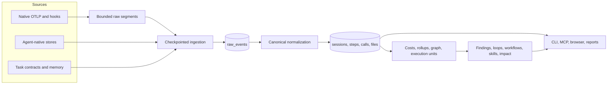

# Reflect current architecture

Status: current implementation.
Last reviewed: 2026-08-08

This document describes the architecture that exists on this branch. It is a
navigation aid and decision record, not a roadmap. When it disagrees with code
or a SQLite migration, the implementation is authoritative and this document
must be corrected.

## Product boundary

Reflect is a local-first evidence and improvement loop for AI coding agents:

> capture evidence -> discover a repeated procedure -> review a bounded
> workflow -> install with approval -> measure comparable future tasks

Reflect does not rank developers, infer success from configuration, or treat a
long-lived chat session as one comparable task. It distinguishes observed
outcome movement from impact attributable to an installed workflow.

## System at a glance



The dependency direction is:

```text
source adapters -> ingestion -> normalization -> canonical SQLite
    -> derived state -> application services -> presentation
```

Presentation objects are never aggregation inputs. Dashboard cards, truncated
session rows, and chart series are views over canonical evidence.

## Runtime ownership

| Area | Owner | Responsibility |
|---|---|---|
| CLI composition | `src/reflect/core.py` | Click entry point, command wiring, setup, and top-level operator flows |
| CLI shared contracts | `src/reflect/cli/common.py` | Reflect home, JSON output, and query-only snapshot readiness |
| CLI progress | `src/reflect/cli/progress.py` | Rich preparation feedback on stderr without contaminating command output |
| Database commands | `src/reflect/cli/database.py` | Ingest, retention, vacuum, and database inspection commands |
| Memory and schema commands | `src/reflect/cli/memory.py`, `schema.py` | Scoped memory lifecycle and schema export |
| Preparation policy | `src/reflect/preparation.py` | Snapshot states, profiles, progress, background lifecycle, and coordinator |
| Preparation pipeline | `src/reflect/preparation_pipeline.py` | Migrate, ingest, normalize, reconcile, derive, and publish a refreshed snapshot |
| MCP | `src/reflect/mcp.py`, `context.py`, `changes.py` | Task guidance, completion, evidence inspection, and approval-gated changes |
| Browser queries | `src/reflect/dashboard_query_common.py`, `dashboard_queries.py`, `dashboard_sessions.py`, `dashboard_explore.py` | Shared contracts, overview, session drill-down, and Explore read models |
| Improvement browser adapter | `src/reflect/dashboard_improvements.py` | Connection lifecycle and dashboard-ready findings, workflows, skills, and impact models |
| Browser server | `src/reflect/dashboard_server.py` | HTTP routes, cache ownership, error mapping, and local server construction |
| Browser source | `src/reflect/frontend/` | Authored HTML template plus domain-oriented CSS and JavaScript modules |
| Browser artifacts | `src/reflect/data/index.html`, `docs/report.html` | Generated, byte-identical single-file clients |
| OTLP gateway | `src/reflect/gateway.py`, `raw_segments.py` | Receive OTLP, append active files, and rotate immutable segments |
| Agent capabilities | `src/reflect/agent_capabilities.py` | Support level, aliases, paths, hooks, skills, MCP, and headless-test surfaces |
| Native store access | `src/reflect/opencode_store.py` | Typed read-only access to OpenCode's relational source records |
| Conversation projection | `src/reflect/conversation_adapters.py` | Convert native provider records into high-fidelity session detail |
| Cursor usage enrichment | `src/reflect/store/cursor_usage.py` | Add provenance-marked transcript usage estimates when exact usage is absent |
| Session-rule context | `src/reflect/session_rules/context.py` | Map canonical summaries or detailed spans into scoring inputs |

`reflect.core:main` remains the installed CLI entry point. Domain logic belongs
in the focused owner above, not in command handlers.

## Capture and raw-data lifecycle

The gateway writes only to:

- `otel-traces.active.jsonl`
- `otel-logs.active.jsonl`

One gateway process owns each active path. Within that boundary,
`RawSegmentWriter` serializes appends and atomically rotates an active file
before it exceeds the configured bound. Closed segments are immutable,
timestamp-named JSONL files. Refresh reads closed segments oldest-first and then
the active segment.

`source_ingestion_state` records the source fingerprint, append checkpoint,
relational record cursor, decoder version, normalization time, and raw deletion
time. JSONL sources advance byte offsets; OpenCode advances a composite
`(time_updated, session_id)` cursor and reads only new or updated sessions. A
closed segment is eligible for deletion only after every inserted raw event
completed canonical normalization. The active segment is never deleted by
refresh. Operators can retain processed closed segments with
`--keep-processed-raw`.

SQLite is the durable analytical store. Closed raw segments are replay buffers,
not a second database.

## Canonical normalization

`store/normalize.py` and focused helpers promote source evidence into:

- sessions and parent/child relationships
- ordered steps and conversation facts
- LLM calls and token/cost provenance
- one logical tool invocation per `tool_calls` row
- files, repositories, workspaces, agents, and source provenance
- late task-run, memory-exposure, and outcome linkage

### Logical calls and MCP

`tool_calls.logical_call_id` identifies one invocation across provider start,
result, hook, native, and transcript representations. Normalization reconciles
those representations before rollups.

`mcp_calls` is a one-to-one protocol extension keyed by
`mcp_calls.tool_call_id -> tool_calls.id`. It stores server, MCP tool, transport,
protocol, and MCP-session metadata. It does not add another countable call.
Migration 29 converts existing databases to this shape; runtime readers use
only the canonical model.

### Agent capabilities

Setup, doctor, skill distribution, MCP configuration, aliases, and local-agent
tests read the same `AgentCapability` registry. It is product metadata, not a
telemetry parser registry.

Provider-specific responsibilities use precise boundaries: `parsing.py`
discovers native inputs and derives canonical source events,
`opencode_store.py` owns relational source access, `conversation_adapters.py`
owns high-fidelity session projection, and `store/cursor_usage.py` owns derived
usage estimation. These roles do not share a generic adapter lifecycle.

Current capability labels are deliberately per product surface:

- Supported: Claude Code, Cursor, GitHub Copilot, Codex, OpenCode, Windsurf
- Partial: Antigravity, because MCP is testable but native tool telemetry and
  hooks are not verified
- Historical: Gemini CLI telemetry remains readable but is not a current live
  client target
- Planned: inventoried only and never reported as capturing

A verified MCP task run does not imply verified native tokens, cost, hooks, or
conversation capture.

## Snapshot preparation

`PreparationCoordinator` owns stateful preparation lifecycle and delegates the
actual work to `prepare_usage_db()` or `prepare_sql_report_db()`.

The complete pipeline is:

1. open and migrate the database
2. ingest selected changed sources
3. normalize pending raw events
4. reconcile logical calls, MCP metadata, workspace identity, native estimates,
   task runs, and memory exposures
5. refresh pricing for affected sessions
6. refresh bounded graph and rollup keys, or rebuild only when the refresh plan
   proves that incremental repair is insufficient
7. refresh execution units, archetypes, findings, loops, workflows, skills, and
   impact
8. delete successfully processed closed raw segments unless retention was
   requested
9. publish `last_successful_refresh`

Read commands inspect query-only snapshots. Mutation is explicit through a
refresh, setup, apply, rollback, retention, or database command.

## Evidence units

| Object | Meaning | Canonical owner |
|---|---|---|
| Session | Provider conversation or long-lived agent container | `sessions` |
| Step | Ordered activity inside a session | `steps` |
| LLM call | One normalized model request/response | `llm_calls` |
| Tool call | One normalized logical invocation | `tool_calls` |
| Execution unit | One bounded task used for procedure evidence and comparison | `execution_units` |
| MCP task run | Explicit `reflect_context` to `reflect_complete` lifecycle | `mcp_task_runs` |
| Task archetype | Comparable-task classification | `execution_unit_archetypes` |
| Task contract | Explicit bounded work and completion conditions | `TaskContract`; stored in the existing `specs` table |

Sessions remain useful for navigation and whole-conversation usage totals. They
are not workflow support or impact samples. Procedure discovery, evidence
ledgers, adherence, and measurements use distinct eligible execution units.
Session IDs remain provenance links so a developer can inspect the source.

An explicit completed MCP task run is the strongest execution boundary. Other
sources may produce bounded units only when their evidence supports a task
boundary. Ambiguous or mixed units are excluded from comparable cohorts.

## Workflow identity and lifecycle

A workflow is a reviewed procedure attached to comparable task evidence.

| Concept | Identity or state |
|---|---|
| Procedure identity | `contract_signature` derived from normalized workflow contract semantics |
| Candidate revision | `revision_hash` derived from exact reviewable content |
| Review | `pending`, `approved`, `stale`, or `rejected` |
| Deployment | `not_deployed`, `active`, `stale`, or `rolled_back` |
| Installation | `not_installed`, `installed`, `stale`, or `removed` |
| Measurement | `not_started`, `collecting`, `improved`, `no_effect`, or `regressed` |

These dimensions are projected into one `WorkflowLifecycleProjection`; they are
not aliases for one overloaded status. Approving a candidate creates review
state. Applying an exact reviewed version to a target creates the intervention
and installation state. An approved but uninstalled workflow is never selected
as executable guidance.

```mermaid
flowchart LR
    Evidence[Eligible execution units] --> Finding[Finding or loop]
    Finding --> Candidate[Workflow candidate]
    Candidate -->|review and approve| Version[Immutable version]
    Version -->|explicit target apply| Install[Intervention and installation]
    Install --> Exposure[Comparable future executions]
    Exposure --> Measure[Five-task validation]
    Measure --> Decision[Keep, revise, or roll back]
```



All repository or external writes use exact preview, explicit approval, and
hash-bound apply/rollback records.

## Impact contract

Impact uses a frozen baseline cohort and the first bounded comparable
post-install execution units. A measurement records:

- workflow contract and archetype
- exact before and after unit IDs
- sample counts and evidence cutoff
- signal availability and missing telemetry
- outcome direction
- observed workflow exposure/adherence
- evidence-quality reason when a claim is withheld

Missing evidence is `unavailable`, never numeric zero. Reflect may report an
observed outcome shift without claiming attribution. Attribution requires a
comparable cohort plus corroborated installed-workflow exposure.

## Context artifacts

| Object | Meaning | Canonical owner |
|---|---|---|
| Memory | Durable scoped instruction or fact identity | `memories` |
| Memory exposure | Fingerprint proving one execution received that memory | `memory_exposures` |
| Task contract | Explicit task-start artifact | `TaskContract` and `mcp_task_runs.task_contract_id` |
| Workflow contract | Reusable procedure semantics and checkpoints | versioned workflow content |

Provider adapters recognize explicit source envelopes. They do not infer memory
from arbitrary conversation text or reinterpret transient planning calls as
task contracts.

## Browser architecture

The browser exposes five product surfaces:

1. Sessions — source conversations, usage, cost, tools, and comparisons
2. Workflows — findings, loops, and reviewable workflows
3. Skills — durable versions, installation targets, exposure, and usage evidence
4. Impact — measured comparable-task progress and evidence quality
5. Explore — usage, tools, graph, and context/task-contract diagnostics

`dashboard_queries.py` builds bounded read models from SQLite.
`dashboard_server.py` wires those functions to FastAPI and owns server/cache
lifecycle. The authored client lives in `src/reflect/frontend/`; running
`scripts/build_dashboard.py` produces both shipped HTML files. Generated files
must never be edited independently.

Interactive graph queries filter to the selected session IDs and displayed
tools before joins. Timeline payloads remain capped. Large evidence is fetched
through explicit drill-down APIs instead of embedding complete ledgers in the
initial report.

## One-way migration policy

Existing databases move forward through numbered SQLite migrations. A migration
may rewrite or drop an obsolete table or column after moving its durable data.
The runtime does not keep parallel readers, dual writes, old API routes, or
presentation aliases for the retired shape. Rollback is restoring a pre-migrate
database backup and the matching older binary, not switching a runtime flag.

Historical migration files remain immutable. New schema changes get a new
numbered migration and idempotency coverage.

## Architecture decisions

| ID | Decision | Consequence |
|---|---|---|
| A-001 | SQLite is the local analytical source of truth. | Every product surface reads the same durable evidence. |
| A-002 | Preserve source provenance while promoting shared canonical fields. | Cross-agent analysis remains explainable. |
| A-003 | Reads are query-only; refresh and mutation are explicit. | Dashboard traffic cannot silently rewrite the store. |
| A-004 | Execution units are the procedure and impact sample. | Long-lived sessions do not contaminate task cohorts. |
| A-005 | Workflow contract identity is separate from revision identity. | Wording edits do not create a new procedure; semantic changes do. |
| A-006 | Review, deployment, installation, and measurement are separate lifecycle dimensions. | Cards cannot imply that approval means installation or impact. |
| A-007 | `tool_calls` is the only logical-call ledger; `mcp_calls` is metadata. | MCP and total tool counts cannot double-count one invocation. |
| A-008 | Agent support is declared once and per surface. | Configuration never masquerades as captured telemetry. |
| A-009 | Closed raw segments are disposable after successful normalization. | Raw disk growth is bounded without deleting canonical evidence. |
| A-010 | Browser queries, server wiring, and authored client sources are separate owners. | UI changes do not grow a monolithic server module. |
| A-011 | OOP is for state, lifecycle, strategy, and ownership; pure transforms stay functions. | Abstractions must remove duplication or isolate a demonstrated variant. |
| A-012 | Database evolution is one-way. | New code has one runtime model instead of compatibility branches. |

## Change guardrails

Before adding a product concept, answer:

1. What is the user-facing noun?
2. What is its stable identity?
3. Which table and module own writes?
4. What is the evidence unit?
5. Which lifecycle dimension changes?
6. What makes refresh idempotent?
7. What exact evidence lets the UI make the claim?

Implementation defaults:

- extend execution units instead of adding another task model
- extend workflow contracts instead of identifying procedures by titles
- extend `tool_calls` rather than adding another invocation ledger
- derive presentation state from canonical records
- keep provider differences behind capability adapters and classifiers
- keep SQL bounded before joins and paginate evidence drill-downs
- split a module only along an existing ownership boundary
- delete retired runtime paths when a one-way migration replaces them

Update this document when canonical identity, evidence granularity, module write
ownership, lifecycle, or the end-to-end preparation path changes.
